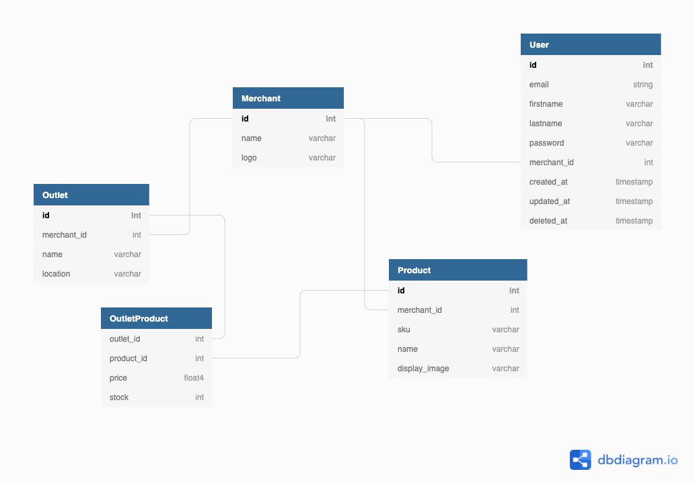

# Point of Sale

# How To Run POS API Service (DEV Environment)
1. Make sure you already have PostgreSQL instance
1. Create local config.yaml file
    ```
    $ cp example-config.yaml config.local.yaml
    ```
1. Run The Service Using These Commands
    ```
    $ make tidy
    $ make mock-prepare
    $ make mock
    $ make test
    $ make run 
    ```

# Database Schema


Migration file can be found at `database/schema.sql`

# Documentation
Postman API Docs: [Postman](https://documenter.getpostman.com/view/9584176/UVJWqfBg)
